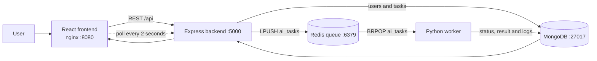

# AI Task Platform

## Project Overview

AI Task Platform is an authenticated, asynchronous text-processing application. Users register, log in, create a task, choose a text operation, and queue the task from a protected React dashboard. A Node.js/Express backend stores users and tasks in MongoDB and publishes jobs to a Redis queue. An independently running Python worker processes those jobs and writes results and execution logs back to MongoDB.

The project includes local Docker Compose orchestration, Kubernetes manifests, an Argo CD GitOps Application, and a GitHub Actions CI/CD pipeline.

## Features

- User registration followed by login
- JWT authentication and protected frontend routes
- Per-user task authorization
- Task creation and asynchronous execution
- Redis-backed `ai_tasks` work queue
- Independently scalable Python worker
- Uppercase conversion
- Lowercase conversion
- Reverse string
- Word count
- `Pending`, `Running`, `Success`, and `Failed` task states
- Results, errors, timestamps, and execution logs
- Automatic dashboard refresh every two seconds
- Manual task-list refresh and task rerun

## Technology Stack

| Area | Technology |
|---|---|
| Frontend | React 19, Vite, React Router, nginx |
| Backend | Node.js 22, Express 5, Mongoose |
| Database | MongoDB 8 |
| Queue | Redis 7 with AOF persistence |
| Worker | Python 3.13, PyMongo, redis-py |
| Authentication | JWT and bcrypt |
| Containerization | Docker and Docker Compose |
| Orchestration | Kubernetes and Kustomize |
| GitOps | Argo CD |
| CI/CD | GitHub Actions and Docker Hub |

## Project Structure

```text
AI-Task-Platform/
├── .github/
│   └── workflows/
│       └── ci-cd.yml
├── backend/
│   ├── src/
│   │   ├── config/
│   │   ├── controllers/
│   │   ├── middleware/
│   │   ├── models/
│   │   ├── routes/
│   │   └── utils/
│   ├── Dockerfile
│   ├── package.json
│   └── server.js
├── frontend/
│   ├── src/
│   ├── Dockerfile
│   ├── nginx.conf
│   └── package.json
├── worker/
│   ├── Dockerfile
│   ├── requirements.txt
│   └── worker.py
├── infrastructure/
│   ├── argocd/
│   │   ├── application.yaml
│   │   └── README.md
│   └── kubernetes/
│       ├── kustomization.yaml
│       └── *.yaml
├── docs/
│   ├── architecture.md
│   ├── github-actions-setup.md
│   └── submission-checklist.md
├── .env.example
├── docker-compose.yml
└── README.md
```

## System Architecture



For scaling, reliability, security, GitOps, and production recommendations, see the [architecture document](docs/architecture.md).

## Task Processing Flow

1. The React frontend sends an authenticated task request to the Express backend.
2. The backend validates the request and creates a `Pending` task in MongoDB.
3. When the user selects **Run Task**, the backend pushes its ID to the Redis `ai_tasks` list.
4. A Python worker consumes the ID, loads the task from MongoDB, and marks it `Running`.
5. The worker executes `uppercase`, `lowercase`, `reverse`, or `word_count`.
6. The worker updates MongoDB with `Success` and the result, or `Failed` and an error.
7. The frontend polls the API every two seconds and displays the latest status, result, and logs.

```text
Frontend → Backend → MongoDB → Redis Queue → Python Worker
    ↑                                           ↓
    └──────── Result through API ← MongoDB Update
```

## API Endpoints

The default API base URL for local development is `http://localhost:5000/api`.

| Method | Endpoint | Authentication | Purpose |
|---|---|---|---|
| `GET` | `/api/health` | Public | Return backend health status |
| `POST` | `/api/auth/register` | Public | Create a user account |
| `POST` | `/api/auth/login` | Public | Verify credentials and return a JWT |
| `GET` | `/api/auth/me` | Bearer JWT | Return the authenticated user |
| `POST` | `/api/tasks` | Bearer JWT | Create a Pending task |
| `GET` | `/api/tasks` | Bearer JWT | List the user's newest 100 tasks |
| `GET` | `/api/tasks/:id` | Bearer JWT and owner | Retrieve one owned task |
| `POST` | `/api/tasks/:id/run` | Bearer JWT and owner | Queue or rerun an owned task |

## Environment Variables

Copy the committed `.env.example` templates and replace placeholder values locally. Never commit real credentials.

### Frontend

| Variable | Example | Description |
|---|---|---|
| `VITE_API_URL` | `http://localhost:5000/api` | API base URL embedded in the Vite build. Kubernetes/CI builds use `/api`. This is public configuration, not a secret. |

### Backend

| Variable | Example | Description |
|---|---|---|
| `PORT` | `5000` | Express listen port |
| `MONGO_URI` | `mongodb://127.0.0.1:27017/ai_task_platform` | MongoDB connection URI |
| `REDIS_URL` | `redis://127.0.0.1:6379` | Redis connection URL |
| `JWT_SECRET` | `REPLACE_WITH_A_LONG_RANDOM_SECRET` | Private key material used to sign JWTs; replace the placeholder |
| `CLIENT_URL` | `http://localhost:5173` | Exact browser origin allowed by CORS |

### Worker

| Variable | Example | Description |
|---|---|---|
| `MONGO_URI` | `mongodb://127.0.0.1:27017/ai_task_platform` | MongoDB database containing tasks |
| `REDIS_URL` | `redis://127.0.0.1:6379` | Redis queue connection URL |

Inside Compose and Kubernetes, the service hostnames are `mongo` and `redis` instead of `127.0.0.1`.

## Local Development

### Prerequisites

- Git
- Node.js 22+
- Python 3.13+
- MongoDB on `127.0.0.1:27017`
- Redis on `127.0.0.1:6379`

Clone and enter the repository:

```bash
git clone https://github.com/ayush31082005/AI-Task-Platform.git
cd AI-Task-Platform
```

Create local environment files:

```bash
cp backend/.env.example backend/.env
cp frontend/.env.example frontend/.env
cp worker/.env.example worker/.env
```

Replace `JWT_SECRET` in `backend/.env` with a long random value. Start each component in a separate terminal.

Backend:

```bash
cd backend
npm install
npm run dev
```

Frontend:

```bash
cd frontend
npm install
npm run dev
```

Worker using Git Bash on Windows:

```bash
cd worker
python -m venv .venv
source .venv/Scripts/activate
pip install -r requirements.txt
python worker.py
```

Open <http://localhost:5173>. The backend health endpoint is <http://localhost:5000/api/health>.

> Local source-mode development requires MongoDB and Redis to be reachable on the host ports above. The repository's Compose configuration keeps those database ports internal, so use the complete Compose stack below if local database services are not separately installed.

## Docker

Docker Compose builds the frontend, backend, and worker images and starts MongoDB and Redis. First create the root environment file and replace its JWT placeholder:

```bash
cp .env.example .env
docker compose down
docker compose up --build -d
docker compose ps
```

Useful commands:

```bash
docker compose logs -f
docker compose logs -f backend
docker compose logs -f worker
docker compose down
```

- Frontend: <http://localhost:5173> (host `5173` → container `8080`)
- Backend: <http://localhost:5000>
- MongoDB and Redis: internal Compose services with persistent named volumes
- Redis AOF: enabled to replay persisted queue changes after ordinary restarts

## Kubernetes

The Kustomize setup deploys namespace `ai-task-platform`, two frontend replicas, two backend replicas, independently scalable workers, single-replica MongoDB/Redis with PVCs, ClusterIP Services, and nginx Ingress host `ai-task.local`.

Prerequisites include a Kubernetes cluster, nginx Ingress Controller, Metrics Server for the worker HPA, a default StorageClass, and valid image/secret configuration.

```bash
kubectl kustomize infrastructure/kubernetes
kubectl apply -k infrastructure/kubernetes
kubectl get all -n ai-task-platform
kubectl get ingress,pvc,hpa -n ai-task-platform
```

On Windows, map the Ingress IP for `ai-task.local` in `C:\Windows\System32\drivers\etc\hosts`. Detailed instructions are in the [Kubernetes guide](infrastructure/kubernetes/README.md).

## Argo CD

The Application uses automated synchronization with pruning and self-healing:

```bash
kubectl apply -n argocd -f infrastructure/argocd/application.yaml
kubectl get application ai-task-platform -n argocd
```

Before applying, replace `YOUR_GITHUB_USERNAME` in `infrastructure/argocd/application.yaml` and ensure `repoURL` points to the repository that actually contains `infrastructure/kubernetes`. See the [Argo CD guide](infrastructure/argocd/README.md) for installation, UI access, synchronization, and troubleshooting.

## GitHub Actions

The [CI/CD workflow](.github/workflows/ci-cd.yml) runs on pushes and pull requests to `main`, plus manual dispatch. It:

- Lints the backend and frontend
- Builds the frontend
- Validates Python syntax
- Validates YAML, Docker Compose, and Kustomize
- Builds all three Docker images on pull requests without pushing
- Pushes SHA-tagged and `latest` images to Docker Hub on `main`
- Updates Kubernetes Kustomize image tags and commits them with `[skip ci]`

Main-branch publishing requires GitHub repository secrets `DOCKERHUB_USERNAME` and `DOCKERHUB_TOKEN`. Setup and security details are in the [GitHub Actions guide](docs/github-actions-setup.md).

## Security

- Passwords are hashed using bcrypt with cost factor 12.
- JWTs are signed using `JWT_SECRET`, expire after seven days, and are required by every task route.
- Task database queries include the authenticated `userId` to enforce ownership.
- Helmet configures HTTP security headers.
- CORS permits only `CLIENT_URL` and enables credentials support.
- Express limits JSON bodies to 32 KiB.
- API rate limiting allows 300 requests per 15-minute window using the configured default client key behavior.
- Controllers validate required fields, password length, and supported operations; Mongoose validates field sizes, enums, and unique email.
- Application containers run as non-root, and Kubernetes drops Linux capabilities where compatible.

For production, HTTPS, managed secrets, token rotation/revocation, NetworkPolicies, centralized audit logs, and stronger schema validation are recommended.

## Screenshots

The following submission screenshots still need to be captured and added:

### Frontend

> Placeholder: add a screenshot of the login/register page or dashboard.

### Task List

> Placeholder: add a screenshot showing tasks, statuses, results, and execution logs.

### Docker

> Placeholder: add a screenshot of `docker compose ps` or the running stack in Docker Desktop.

### Argo CD

> Placeholder: add a screenshot showing the application health, sync status, and resource tree.

## Future Improvements

The following are recommendations and are not currently installed:

- Prometheus metrics for API, worker, Redis, MongoDB, and queue behavior
- Grafana dashboards and operational alerting
- Loki or another centralized logging platform
- User notifications when asynchronous tasks complete
- Redis queue-length and oldest-job-age metrics
- KEDA or custom-metric worker autoscaling instead of CPU-only scaling
- Acknowledged jobs, retries, idempotency, and a dead-letter queue
- Managed high-availability MongoDB and Redis
- TLS, external secret management, backups, and recovery testing

## Author

**YOUR NAME**

Replace this placeholder with the submitter's actual name before final submission.

## License

MIT

This README identifies the intended license as MIT. Add a root `LICENSE` file before public distribution if the repository does not yet contain one.
