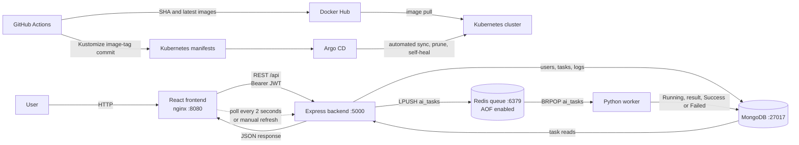

# AI Task Platform Architecture

## 1. Project overview

AI Task Platform is a small asynchronous text-processing system. A user registers, logs in, creates a task, explicitly queues it, and follows its state and result from a React dashboard. The repository separates the browser UI (`frontend`), HTTP API (`backend`), and background processor (`worker`). MongoDB is the system of record and Redis is the work queue. The same application can run locally with Docker Compose or in the `ai-task-platform` Kubernetes namespace.

## 2. Functional requirements

The current application provides registration and login, a protected dashboard, per-user task creation and retrieval, asynchronous execution, execution logs, and result display. A task contains a title, input text, and one supported operation. Creation records a `Pending` task but does not enqueue it until the user selects **Run Task**. The dashboard lists the newest 100 tasks and refreshes automatically every two seconds, with an additional manual refresh control.

## 3. High-level architecture

The synchronous path ends after queue publication; processing happens independently. In Kubernetes, nginx Ingress routes `/api` to the backend Service and `/` to the frontend Service for host `ai-task.local`.

## 4. Component responsibilities

- `frontend`: React/Vite single-page application, route protection, forms, local JWT storage, task display, and polling. Its production nginx container listens on `8080`; Compose maps host `5173` to it, while Kubernetes exposes Service port `80`.
- `backend`: Node.js/Express API on `PORT=5000`. It authenticates users, enforces task ownership, validates requests, persists task metadata, and publishes task IDs to Redis.
- `worker`: Python 3.13 process with no HTTP Service. It blocks on Redis, loads canonical task data from MongoDB, performs the operation, and writes status, result, errors, timestamps, and logs.
- MongoDB 8: durable source of truth for users and tasks, available internally as `mongo:27017`.
- Redis 7 Alpine: queue transport, available internally as `redis:6379`; it persists append-only commands to its volume.

## 5. Request and task processing flow

1. The frontend sends `POST /api/tasks` with `title`, `inputText`, and `operation`.
2. The backend verifies the Bearer token and creates a MongoDB record with `Pending` and log `Task created`.
3. The user invokes `POST /api/tasks/:id/run`. The API checks ownership, resets previous output fields, appends `Task queued`, saves, and `LPUSH`es `{taskId}` to `ai_tasks`.
4. A worker uses `BRPOP`, loads the task, changes it to `Running`, processes its stored input, and writes the final state.
5. The frontend calls `GET /api/tasks` every two seconds. Selecting a task displays its latest input, result/error, and logs. `GET /api/tasks/:id` is also implemented for one task.

## 6. Authentication and authorization flow

`POST /api/auth/register` normalizes email, requires an eight-character password, hashes it with bcrypt cost factor 12, and returns a message instructing the user to log in. It does not automatically authenticate registration. `POST /api/auth/login` compares the password hash and returns a JWT whose `sub` is the user ID and whose lifetime is seven days. The frontend stores the token in `localStorage` and sends `Authorization: Bearer <token>`.

On startup or refresh, the UI calls protected `GET /api/auth/me`; failure clears the token and redirects to `/login`. Backend authentication verifies `JWT_SECRET` and reloads the user. Every task query includes both task identity and authenticated `userId`, so one user cannot read or run another user's task. This is application-level ownership authorization; no roles are implemented.

## 7. Redis queue and Python worker architecture

The queue is a Redis list named `ai_tasks`. Producers use `LPUSH`; independently scalable workers use blocking `BRPOP`, producing FIFO behavior across opposite list ends. Payloads contain only `taskId`, keeping MongoDB authoritative for operation and input. Each worker processes one job at a time in its process. Multiple replicas compete safely for different list entries, although duplicate publications can still cause repeated execution.

Redis AOF is enabled in Compose and Kubernetes so queue-changing commands are written to persistent storage and can be replayed after an ordinary Redis restart. AOF reduces loss compared with memory-only Redis, but it does not make the present dequeue protocol fully reliable because `BRPOP` removes a job before completion.

## 8. Task lifecycle

- **Pending:** created but not necessarily queued, or reset immediately before queue publication.
- **Running:** a worker loaded the task and set `startedAt`; the UI counts both Pending and Running as active.
- **Success:** processing completed, `result` and `completedAt` were stored, and a success log was appended.
- **Failed:** the worker caught an operation-time exception, stored its text in `error`, set `completedAt`, and appended a failure log.

The current API permits rerunning Success or Failed tasks and rejects only a task already marked Running.

## 9. Supported operations

- `uppercase`: Python `text.upper()`.
- `lowercase`: Python `text.lower()`.
- `reverse`: Python slice `text[::-1]`.
- `word_count`: number of whitespace-separated tokens from `len(text.split())`; the result is numeric.

Both Mongoose enum validation and the backend controller restrict operation values to `uppercase`, `lowercase`, `reverse`, and `word_count`.

## 10. MongoDB data model summary

`User` stores `name`, normalized `email`, and `passwordHash`, plus timestamps. The password hash is excluded from normal queries. `Task` stores `userId`, title, input text (maximum 10,000 characters), operation, status, mixed-type result, error, embedded timestamped logs, `startedAt`, `completedAt`, and Mongoose timestamps. Title is limited to 120 characters. Task logs are embedded because the current UI retrieves them with the task and their lifecycle is identical.

## 11. MongoDB indexing strategy

- `users.email` is indexed and unique, supporting login lookup and database-level duplicate prevention.
- `{ userId: 1, createdAt: -1 }` supports the dashboard's per-user newest-first query.
- `{ status: 1, createdAt: -1 }` supports operational searches for recent Pending, Running, Success, or Failed tasks.

Single-field `userId` and `status` indexes are also declared by field options. In production, use `explain()` and index-usage metrics to identify redundant indexes and balance read speed against write and storage cost. Large `inputText`, `result`, and `logs` fields should not be indexed.

## 12. Worker scaling strategy

The worker Deployment starts with two replicas and has no Service, so it can scale independently of HTTP traffic. Its HPA permits 2–10 replicas at 70% average CPU with a five-minute scale-down stabilization window. This works as a portable baseline. For production, queue length and oldest-job age are better scaling signals than CPU: a worker waiting on Redis uses little CPU even while a burst is accumulating. KEDA or a Prometheus custom-metrics adapter should scale from `LLEN ai_tasks`, latency targets, and measured processing time while respecting MongoDB and Redis connection capacity.

## 13. Strategy for approximately 100,000 tasks per day

100,000 tasks/day averages about 1.16 tasks/second, but capacity must target peak bursts. Measure p50/p95/p99 queue delay and processing duration, then size workers from peak arrival rate rather than the daily average. Use multiple API and worker replicas across failure domains, managed HA Redis, a MongoDB replica set, connection-pool tuning, pagination, task/log retention, per-user quotas, and load tests. Add idempotency keys, bounded retry counts, a dead-letter queue, and back-pressure when queue age exceeds the service objective. The four current operations are lightweight; the artificial one-second worker delay is the main throughput constraint in this implementation.

## 14. Redis failure handling and recovery

Currently, the backend must ping Redis before it starts, both clients log connection errors, Compose restarts containers, Kubernetes probes Redis, and AOF data lives on a persistent volume. Worker loop errors wait three seconds before retrying. However, a failure after MongoDB is set to Pending but before `LPUSH` leaves an unqueued task, and a worker crash after `BRPOP` can strand a Running task.

**Production recommendation:** replace the raw list with Redis Streams consumer groups or a reliable queue library with acknowledgement, visibility timeout, retry/backoff, and dead-letter handling. Add a reconciler for stale Pending/Running records and make processing idempotent.

## 15. MongoDB failure handling and recovery

The backend refuses startup when its initial MongoDB connection fails. MongoDB has a persistent volume and ping probes; worker database exceptions return to its retrying outer loop. This protects ordinary process restarts but the Kubernetes manifest deploys only one MongoDB replica.

**Production recommendation:** use a managed replica set across zones, encrypted backups, point-in-time recovery, tested restore procedures, majority write concern where appropriate, and alerts for replication lag, storage, connections, and latency. An outbox written atomically with task state should bridge database-to-queue publication.

## 16. Docker and Docker Compose architecture

The backend image is Node 22 Alpine and runs as an `app` user on `5000`. The frontend is a multi-stage Node 22/Vite build served by unprivileged nginx on `8080`. The worker is Python 3.13 Slim running as UID 10001. Compose creates `mongo`, `redis`, `backend`, `worker`, and `frontend` on its internal network, uses health-based dependencies, and persists `mongo_data` and `redis_data`. Only backend `5000` and frontend host `5173` are published. Compose injects `MONGO_URI`, `REDIS_URL`, `PORT`, `CLIENT_URL`, and `JWT_SECRET`.

## 17. Kubernetes deployment architecture

Kustomize composes manifests in `infrastructure/kubernetes`. Frontend and backend each use two replicas and ClusterIP Services; worker starts with two replicas and an HPA. MongoDB and Redis each use one replica, a ClusterIP Service, and a PVC (5 GiB and 1 GiB respectively). Application containers run non-root with dropped capabilities, `RuntimeDefault` seccomp, resource requests/limits, and read-only root filesystems where compatible. Readiness/liveness probes use `/`, `/api/health`, dependency checks for the worker, `mongosh`, and `redis-cli`. ConfigMap values are `PORT=5000`, `MONGO_URI=mongodb://mongo:27017/ai_task_platform`, `REDIS_URL=redis://redis:6379`, and `CLIENT_URL=http://ai-task.local`.

## 18. Argo CD GitOps workflow

The Argo CD Application targets `infrastructure/kubernetes`, revision `main`, cluster server `https://kubernetes.default.svc`, and namespace `ai-task-platform`. Automated sync enables prune, self-heal, and namespace creation. Git is therefore intended as desired state, and Argo CD reconciles the cluster after manifest changes.

The committed `repoURL` is
`https://github.com/ayush31082005/ai-task-platform-infra.git`, which contains
the Kustomize manifests under `infrastructure/kubernetes`.

## 19. GitHub Actions CI/CD workflow

`.github/workflows/ci-cd.yml` runs on pushes and pull requests to `main` and manual dispatch. Separate jobs lint and validate the backend, build/lint the frontend, compile Python, validate YAML/Compose/Kustomize, and build all three images. Main pushes authenticate with `DOCKERHUB_USERNAME` and `DOCKERHUB_TOKEN`, publish `latest` and immutable Git-SHA tags, then use the narrowly scoped `INFRA_REPO_TOKEN` to commit SHA mappings with `[skip ci]` to the separate infrastructure repository. Pull requests build without pushing and cannot update manifests.

## 20. Staging deployment strategy

**Recommendation, not currently implemented:** create a staging namespace or cluster, hostname, secrets, data services, and Kustomize overlay. Promote the same SHA-tagged images rather than rebuilding. Let a staging Argo CD Application auto-sync and run smoke tests for health, registration/login, task ownership, all operations, recovery, probes, and scaling before approving production promotion.

## 21. Production deployment strategy

**Recommendation, not currently implemented:** use reviewed infrastructure pull requests, separate production configuration, TLS ingress, managed multi-zone MongoDB/Redis, external secret management, image digests/signing/scanning, NetworkPolicies, PodDisruptionBudgets, topology spreading, backup restoration tests, and controlled rollout/rollback. The included single-replica data deployments are appropriate for development and assignment demonstration, not production HA.

## 22. Monitoring and observability

No metrics, tracing, dashboard, or alerting stack is installed. Current health endpoints and Kubernetes probes provide basic availability signals. **Future production improvement:** add Prometheus metrics for HTTP rate/error/latency, queue length/age, processing duration/failures, worker count, database latency, Redis memory/AOF health, and PVC use; Grafana dashboards; Loki log aggregation; and alerting for stale tasks, growing queues, failing probes, high error rates, and storage saturation. OpenTelemetry could correlate API publication with worker completion.

## 23. Logging strategy

Express currently uses Morgan `dev` request logging and prints errors to stdout/stderr. Redis and startup events are also logged. Workers print lifecycle/errors and persist user-visible task logs in MongoDB. Containers naturally expose these streams through `docker compose logs` and `kubectl logs`, but logs are not centralized or structured. Production should use JSON logs, request/task correlation IDs, severity levels, redaction, retention, and Loki or another log backend. MongoDB task logs need a size/retention policy.

## 24. Security architecture

Passwords are bcrypt-hashed and never returned. JWT signature verification and per-user database filters protect APIs. Express actually enables Helmet, CORS restricted by `CLIENT_URL`, a 32 KiB JSON request limit, and rate limiting of 300 `/api` requests per 15 minutes per default client key. Controller checks and Mongoose constraints provide basic input validation. Kubernetes application containers use hardened security contexts. Production still requires HTTPS, stricter schema validation, secure headers review, token revocation/rotation, CSRF analysis if authentication moves to cookies, network isolation, RBAC, audit logs, dependency/image scanning, and protection against distributed rate-limit bypass.

## 25. Secrets management

Compose reads `JWT_SECRET` from the environment but has an unsafe demonstration fallback that must be replaced. Kubernetes uses Secret `ai-task-secret`, whose committed value is explicitly a placeholder. GitHub Actions stores Docker Hub credentials in repository secrets and does not expose them to fork pull requests. Production should use a managed secret store (for example External Secrets with a cloud secret manager), encryption at rest, least-privilege access, rotation, and auditability. `VITE_API_URL` is public configuration and must never contain a secret.

## 26. Performance considerations

API replicas are stateless except for external dependencies and can scale horizontally. The compound user/date index supports the primary list query, which is capped at 100 but has no cursor pagination. Frontend two-second polling creates load proportional to active browser sessions. Each Python process handles one job at a time and deliberately sleeps for one second. Production optimization should remove artificial delay, measure before increasing concurrency, introduce pagination, cache only safe reads, use connection-pool limits, compress responses where useful, and replace polling with Server-Sent Events or WebSockets if scale justifies it.

## 27. Reliability and fault tolerance

Two frontend/backend replicas, two or more workers, health probes, restart policies, immutable image tags, persistent volumes, Argo CD self-healing, and Redis AOF improve availability. Task state in MongoDB makes progress visible after process restart. Gaps remain: queue publication is not atomic with MongoDB, jobs are removed before acknowledgement, reruns are not idempotent, data services are single replicas, and no disruption budgets or multi-zone rules exist. These are the priority reliability improvements before production.

## 28. Known limitations

- Raw Redis list jobs have no acknowledgement, retry count, visibility timeout, or dead-letter queue.
- MongoDB save and Redis publication are not transactional; stale tasks require manual rerun.
- Concurrent Run requests can enqueue the same task more than once.
- JWTs in `localStorage` have a seven-day lifetime with no server-side revocation or refresh flow.
- Polling every two seconds and a fixed 100-task list do not scale indefinitely.
- Task logs grow without retention; no centralized monitoring/logging is installed.
- MongoDB and Redis Kubernetes deployments are single-replica and depend on a StorageClass.
- TLS, NetworkPolicies, PodDisruptionBudgets, backups, and disaster recovery automation are absent.
- Argo CD `repoURL` and the Kubernetes secret remain placeholders.

## 29. Future improvements

Priorities are reliable acknowledged queue semantics, idempotency and an outbox, queue-depth autoscaling, stale-task reconciliation, cursor pagination, log retention, managed HA databases, TLS and external secrets, structured telemetry with Prometheus/Grafana/Loki and alerting, and automated backup/restore verification. Later improvements could include push status updates, role-based administration, per-user quotas, formal API schemas, integration/load tests, progressive delivery, and multi-environment Kustomize overlays.

## 30. Assumptions

The document treats the committed source and manifests as authoritative. Kubernetes has an nginx Ingress controller, a default dynamic StorageClass, Metrics Server for CPU HPA, DNS/hosts mapping for `ai-task.local`, and access to the configured Docker Hub images. MongoDB and Redis are trusted internal services without application-level authentication in the current manifests. Expected payloads remain text up to the declared limits, and the four operations are deterministic and safe to repeat even though execution itself is not formally idempotent.

## Architecture summary

AI Task Platform uses a clean asynchronous split: React handles interaction, Express owns authenticated API and queue publication, MongoDB stores truth, Redis distributes work, and horizontally scalable Python workers compute results. Docker Compose supplies local orchestration; Kubernetes, Argo CD, and GitHub Actions provide container deployment and GitOps automation. The implementation is suitable for demonstration and can grow horizontally at the application tier, while production readiness primarily depends on reliable queue acknowledgement, HA data services, stronger secret/network controls, and full observability.

### Current limitations at a glance

The principal current constraints are an at-most-once-style Redis dequeue window, non-atomic database/queue writes, duplicate-run risk, CPU-only worker autoscaling, browser polling, single-replica data services, placeholder deployment secrets/repository URL, and no installed monitoring, centralized logging, TLS, or automated backup system.
