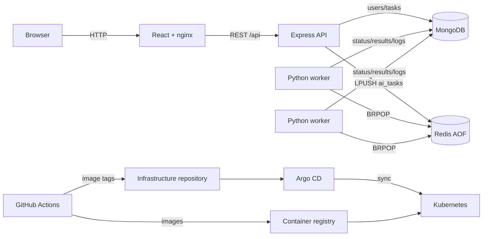

# Architecture Document

## 1. Overall system architecture

The platform separates synchronous HTTP concerns from asynchronous execution.
The React application is compiled into static assets and served by an
unprivileged nginx container. It calls the Express API, which handles identity,
authorization, validation, task metadata, and queue publication. MongoDB is the
system of record. Redis is the work-distribution layer. Stateless Python workers
consume task identifiers, load canonical inputs from MongoDB, execute the chosen
operation, and persist status, result, errors, and append-only execution logs.

The public health endpoint is intentionally unauthenticated for orchestration.
All task routes authenticate the JWT and filter queries by `userId`, preventing
cross-user task access. Components communicate through Kubernetes Services or
Compose service names; databases are not exposed publicly in Compose.

## 2. Worker scaling strategy

Workers are stateless and multiple replicas block on the same Redis list, so each
dequeued job goes to one available consumer. The Kubernetes Deployment starts
with two replicas and can be manually scaled. The included HPA uses CPU as a
portable baseline and scales between 2 and 10 replicas. CPU is only an indirect
signal: production should export Redis queue depth and oldest-job age to
Prometheus and scale through KEDA or a custom metrics adapter. Scaling decisions
should consider average execution time, queue arrival rate, MongoDB capacity,
and Redis connection limits.

## 3. Approximately 100,000 tasks per day

100,000 jobs/day averages about 1.16 jobs/second but traffic will be bursty. The
design should target peak throughput, not the daily average. Run multiple API and
worker replicas across failure domains, use managed Redis with persistence and
high availability, and use a MongoDB replica set with tested backups. Measure
p50/p95/p99 processing latency and calculate worker concurrency from peak arrival
rate and operation duration. Add pagination, log retention, and archival for old
tasks. Apply per-user quotas, payload limits, idempotency keys, bounded retries,
and a dead-letter queue. Load tests should exercise API creation, queue depth,
worker throughput, database writes, and recovery after dependency interruption.

## 4. MongoDB indexing strategy

`users.email` is unique for identity lookup and duplicate prevention. Tasks have
`{ userId: 1, createdAt: -1 }` for the primary dashboard query and
`{ status: 1, createdAt: -1 }` for operational/status queries. These indexes are
declared once in the Mongoose models. Production should verify them with
`explain()`, monitor index size and write cost, and consider TTL/archival only
after defining retention requirements. Avoid indexing large input, result, or log
fields.

## 5. Redis failure handling and recovery

Compose and Kubernetes enable Redis AOF persistence, health probes, restart
behavior, and persistent storage. These protect queued data from ordinary process
restart, but the current `BRPOP` implementation removes a job before completion.
A crash between dequeue and MongoDB completion can strand a task. Production
should use Redis Streams consumer groups, a reliable processing list, BullMQ, or
Celery so work is acknowledged only after completion. Add retry counts,
exponential backoff, visibility timeouts, dead-letter storage, idempotent execution
IDs, and a reconciler that requeues stale `Pending`/`Running` tasks. Alert on queue
depth, oldest-job age, Redis memory, rejected connections, and AOF errors.

## 6. Staging deployment strategy

Use a separate namespace or cluster, non-production secrets and data, smaller
resource limits, and an isolated hostname. Build once and promote the same
immutable SHA-tagged images. GitHub Actions updates a staging overlay or branch;
Argo CD auto-syncs it. Run smoke tests for health, registration, login, all four
operations, ownership authorization, probes, and worker scaling before promotion.
Destructive migration and recovery procedures should be rehearsed here.

## 7. Production deployment strategy

Use a protected infrastructure branch, reviewed pull requests, immutable image
digests/tags, TLS ingress, external secrets, and managed MongoDB/Redis across
availability zones. Argo CD provides automated sync, pruning, and self-healing;
progressive delivery or manual promotion limits blast radius. Define Pod
Disruption Budgets, topology spread, NetworkPolicies, backups, restore testing,
and capacity alerts. The included in-cluster data services are suitable for the
assignment and local clusters, not a production HA database design.

## 8. Monitoring and observability

Emit structured JSON logs with request/task correlation IDs. Capture HTTP request
rate, error rate and latency; queue length and age; task duration and failures;
worker availability; MongoDB latency and connections; Redis memory and AOF state.
Use Prometheus/Grafana for metrics, centralized logs such as Loki/ELK, and OpenTelemetry
traces across API publication and worker execution. Create alerts for health probe
failures, stale tasks, growing queues, elevated failures, and storage saturation.

## 9. Security architecture

Passwords use bcrypt and are excluded from normal model projections. JWTs are
signed with an environment-provided secret and expire after seven days. Express
uses Helmet, strict CORS configuration, request-size limits, and API rate limits.
Authorization filters every task lookup by the authenticated user. Application
containers run without root and drop Linux capabilities where compatible.
Production should use short-lived credentials, HTTPS, token revocation/rotation,
central secret management, image scanning/signing, NetworkPolicies, RBAC, and
audit logging. The committed Kubernetes Secret contains only an obvious template.

## 10. Known limitations

- Redis jobs lack acknowledgement, automatic retry, and dead-letter handling.
- API save and Redis publish are not transactional; an outbox is recommended.
- Simultaneous Run requests can enqueue duplicate work without an idempotency key.
- Dashboard polling is less efficient than push updates at large scale.
- The task list is capped at 100 and logs have no retention policy.
- Health checks prove process availability, not full end-to-end correctness.
- Kubernetes MongoDB/Redis are single replicas and depend on the cluster's default
  StorageClass. TLS and NetworkPolicies are not included in the portable template.
